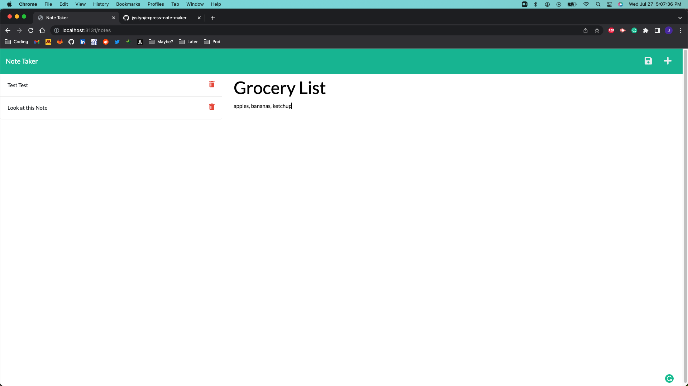
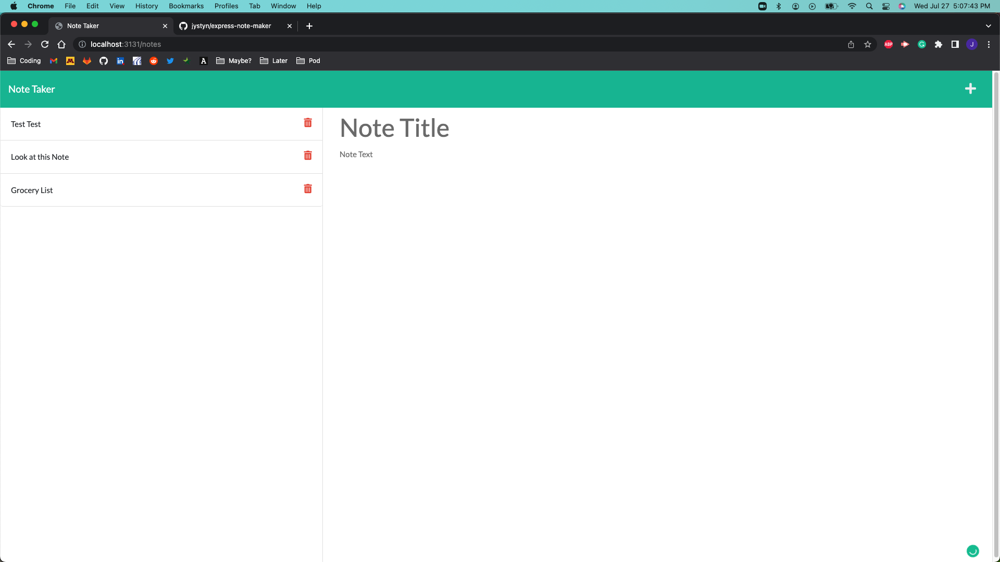
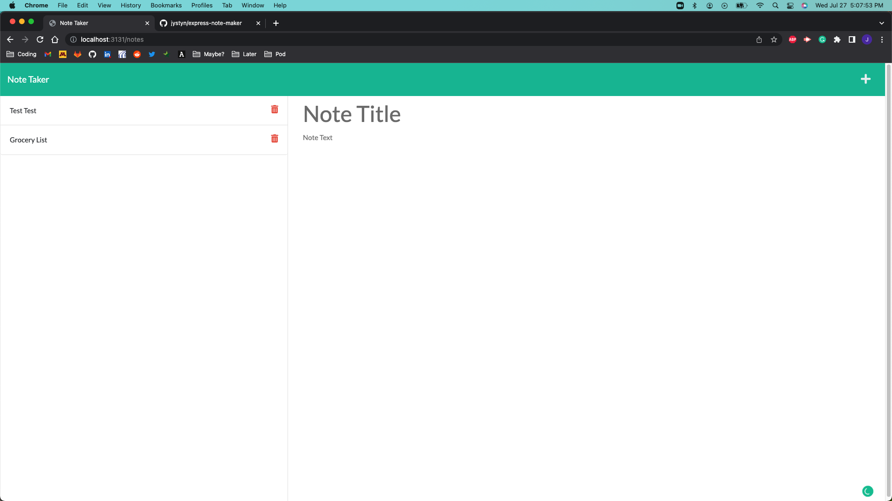

  # Express Note Maker

  


  ## Description
  
  In this assignment we were given the front end of note taking application and we were to create the backend and connect the two while storing and deleting items from a json file.

  ## Table of Contents


  -- [Installation](#Installation)

  -- [Usage](#Usage)

  -- [License](#License)


  ## Installation


  The user should clone this repository from GitHub. They should have node downloaded onto thier machine. 
  
  In order to use the application, the user must install [Express](https://www.npmjs.com/package/express). 
  ```sh
  npm i express
  ```
  
  If the user wants to test the application they must install [uuid](https://www.npmjs.com/package/uuid).
  ```sh
  npm i uuid
  ```

  ## Usage

  
  
  

  ## License


  (https://opensource.org/licenses/MIT)

  This application is licensed under The MIT License


  ## Questions


  [GitHub](https:github.com/jystyn)

  [E-Mail](mailto:justyn.helgeson@gmail.com)

